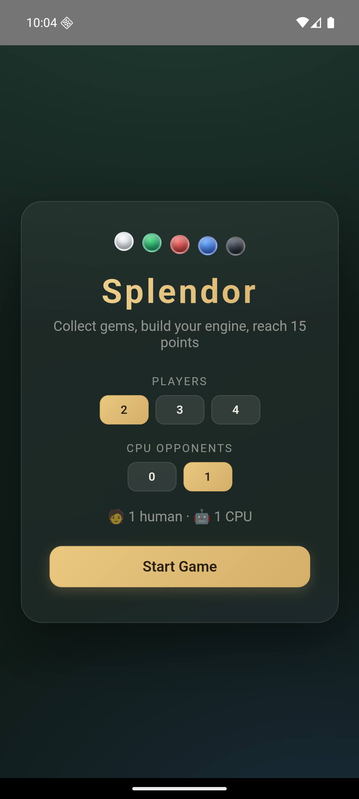

# 💎 Splendor

Versione digitale del gioco da tavolo **Splendor**, giocabile contro avversari
CPU. Un'unica base di codice React che gira come **app web**, **app Android**
(Capacitor) e **app desktop macOS** (Electron).

<p align="center">
  
</p>

## ✨ Caratteristiche

- 🎮 **2–4 giocatori**, con qualsiasi combinazione di umani e CPU
- 🤖 **IA euristica**: compra valutando punti, nobili e sconti permanenti,
  riserva le carte per negarle agli avversari, raccoglie le gemme puntando a
  una carta obiettivo e scarta i gettoni inutili quando ha la mano piena
- 🃏 **Regole fedeli al gioco da tavolo**: limite di 10 gettoni, oro jolly solo
  riservando una carta, 2 gemme uguali solo se in banca ce ne sono 4+, nobili
  che arrivano da soli quando hai i bonus richiesti
- 📱 **Layout responsive**: interfaccia pensata sia per desktop che per
  schermi da telefono
- 🌍 **Tre piattaforme, una codebase**: web, Android e macOS

## 🕹️ Come si gioca

Ogni turno scegli **una** azione:

1. **Prendi gemme** — 3 di colori diversi, oppure 2 uguali (se in banca ce ne
   sono almeno 4). Massimo 10 gettoni in mano.
2. **Compra una carta** — paghi con gemme e oro; i bonus delle carte già
   acquistate fanno da sconto permanente. Le carte danno punti prestigio.
3. **Riserva una carta** (max 3) — la metti da parte per dopo e ricevi un
   gettone d'oro, che vale come jolly.

I **nobili** ti fanno visita (3 punti) quando raggiungi i bonus richiesti.
Vince chi arriva per primo a **15 punti prestigio**.

## 🚀 Avvio rapido

```bash
npm install
npm run dev        # app web su http://localhost:5173
```

## 🖥️ App macOS (Electron)

```bash
npm run electron   # compila e avvia l'app desktop
npm run dist:mac   # crea .dmg e .zip in release/
```

La build non è firmata: la prima volta apri l'app con tasto destro → Apri.

## 📱 App Android (Capacitor)

Richiede Android Studio con l'SDK installato.

```bash
npm run android:open   # compila, sincronizza e apre il progetto in Android Studio
```

Da Android Studio: ▶ Run per emulatore/dispositivo, oppure
*Build → Build Bundle(s) / APK(s)* per generare l'APK.
Per aggiornare solo gli asset web: `npm run android:sync`.

## 🏗️ Architettura

```
src/
├── components/        # interfaccia React
│   ├── Menu.jsx       # schermata iniziale (giocatori / CPU)
│   ├── Game.jsx       # partita: turni, selezione gemme, ciclo IA
│   ├── Board.jsx      # pannello giocatori
│   ├── Player.jsx     # riepilogo del singolo giocatore
│   ├── Cards.jsx      # nobili, carte sviluppo, carte riservate
│   └── GemToken.jsx   # gettone-gemma riutilizzabile
├── services/
│   ├── gameLogic.js   # stato e regole: costi, acquisti, nobili, limiti
│   └── aiLogic.js     # strategia CPU (compra / riserva / raccogli)
└── types/game.js      # costanti condivise

electron/main.cjs      # entry point app macOS
android/               # progetto Android generato da Capacitor
scripts/simulate.js    # test IA-contro-IA
```

La logica di gioco è **pura e senza dipendenze dalla UI**: ogni azione riceve
lo stato e ne restituisce una copia aggiornata. È lo stesso motore usato dai
componenti React, dall'IA e dal test di simulazione.

## 🧠 Come ragiona l'IA

A ogni turno, in ordine di priorità:

1. **Compra** la migliore carta acquistabile (dal tavolo o tra le riservate),
   pesando punti prestigio, avanzamento verso i nobili e sconto del bonus.
2. **Riserva** una carta da 3+ punti che un avversario potrebbe comprare al
   turno successivo (mossa di disturbo).
3. **Raccoglie gemme** mirando alla carta obiettivo più conveniente e
   raggiungibile; se ha la mano piena scambia i gettoni inutili.
4. Se è completamente bloccata, restituisce gettoni alla banca per non
   paralizzare l'economia di gioco.

La stabilità è verificata con partite IA-contro-IA complete:

```bash
npx esbuild scripts/simulate.js --bundle --format=cjs --outfile=/tmp/splendor-sim.cjs && node /tmp/splendor-sim.cjs
```

## 🛠️ Stack

React 17 · Vite 6 · Capacitor 6 · Electron 33

## 📄 Licenza

MIT
